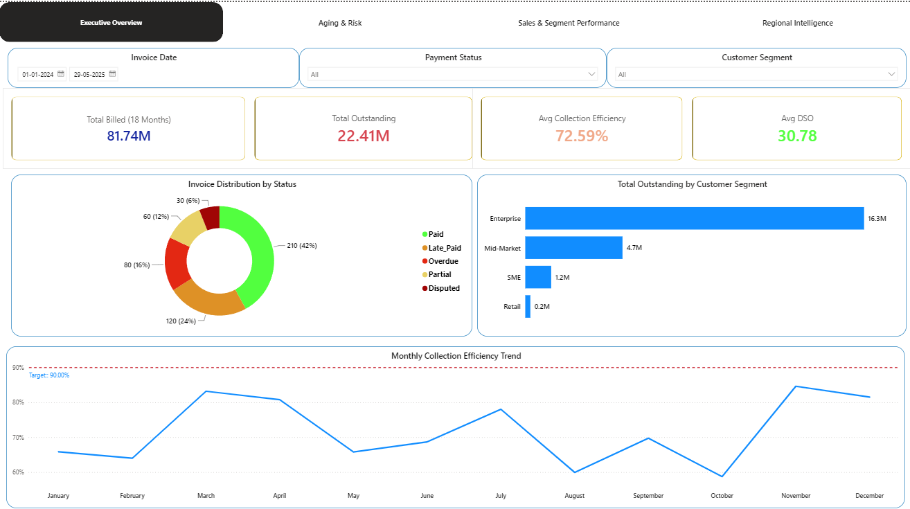
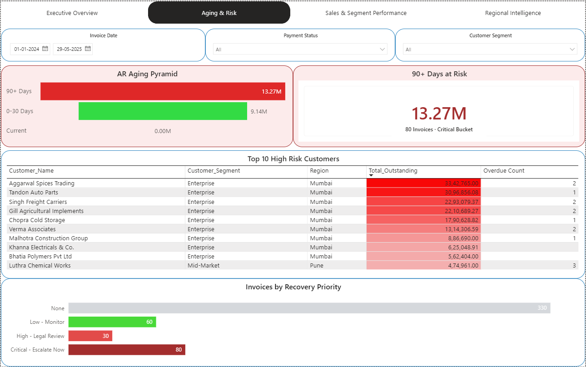
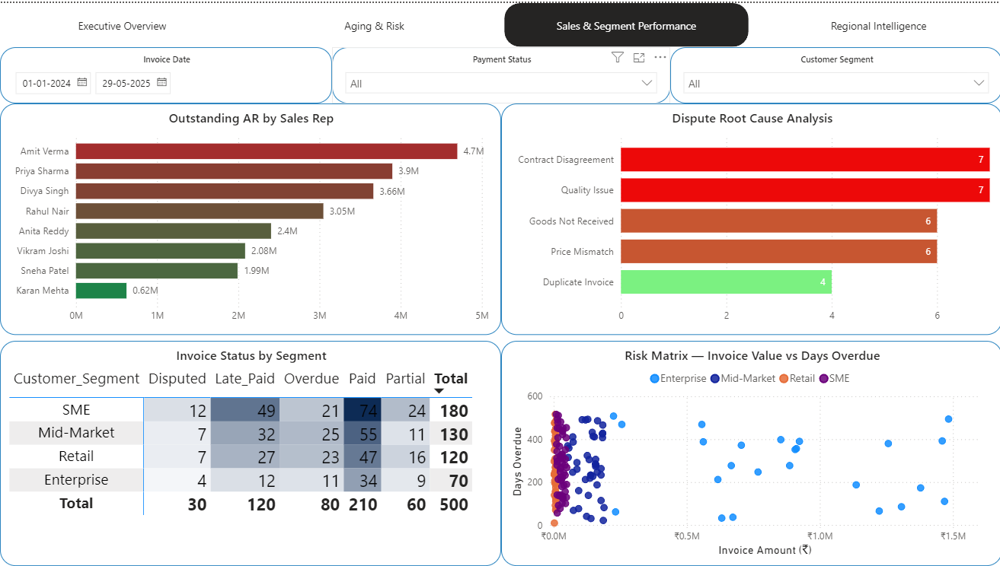
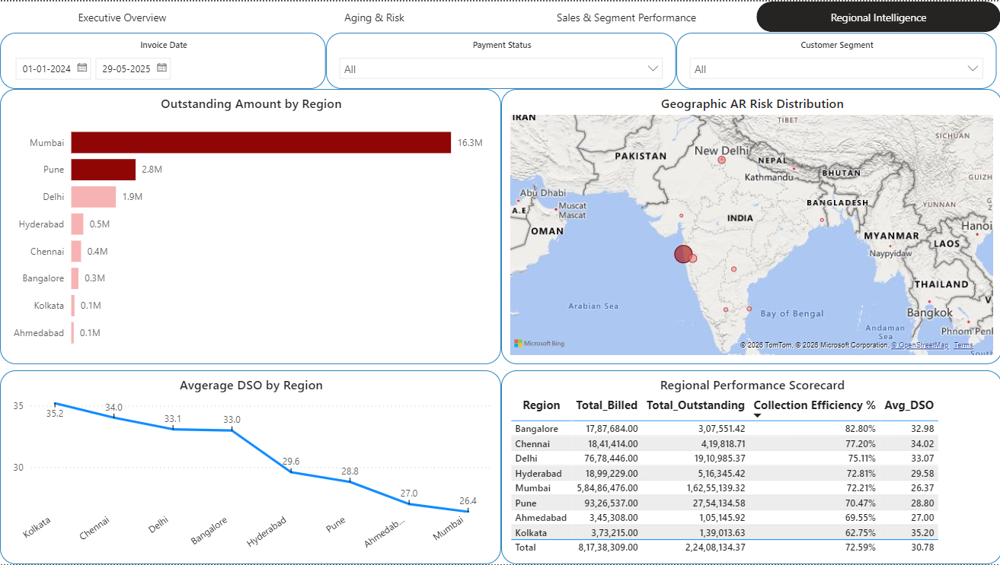

# 📊 The AR Leakage Audit
**₹2.24 Crore was sitting uncollected. I found exactly where — and exactly who to call first.**

[](sql/ar_analysis_queries.sql)
[](dashboard/)
[](data/)

---

## The Headline Number

> **10 of 80 customers** hold **74% of all outstanding receivables** (₹1.66 Cr).
> Recovering just those 10 accounts lifts Collection Efficiency from **72.59% → 92.89%** —
> a +20-point swing from fixing 2% of invoice volume.

That single insight — not the dashboard, not the SQL — is the actual deliverable of this project. Everything below exists to prove it and act on it.

---

## Why This Project Is Different

I spent 2–4 years in Finance, Accounts Receivable, and Customer Service before moving into analytics. Most AR portfolio projects use a Kaggle dataset built by someone who's never chased a late payment. This one is built on the patterns I've actually seen — realistic aging behaviour, partial payments, dispute reasons, and a regional finding (below) that most AR dashboards miss entirely.

---

## What's Inside

| Folder | What You'll Find |
|---|---|
| [`data/`](data/) | 500-invoice dataset, 80 customers, 18 months — built to mirror real AR patterns, not generic sample data |
| [`sql/`](sql/ar_analysis_queries.sql) | 10 SQL questions, each modeled on a question a real CFO or Collections Manager would ask |
| [`dashboard/`](dashboard/) | 4-page Power BI dashboard — Executive Overview, Aging & Risk, Sales & Segment, Regional Intelligence |
| [`reports/`](reports/) | Two full PDF reports: SQL findings with a CFO action memo, and dashboard documentation with quantified scenarios |
| [`screenshots/`](screenshots/) | Dashboard previews (below) |

**Stack:** Excel (data modeling, VLOOKUP) → Power Query (cleaning, 5 calculated fields) → PostgreSQL (10 business queries) → Power BI (6 DAX measures, 4 pages, conditional formatting)

---

## Dashboard Preview

**Executive Overview** — the CFO's first look: 4 KPIs, status mix, segment risk, 17-month efficiency trend vs. 90% target


**Aging & Risk** — where the money is stuck, ranked by urgency


**Sales & Segment Performance** — who owns the risk: reps, dispute root causes, invoice-level scatter


**Regional Intelligence** — geography-based credit risk, including a DSO paradox explained in the full report


---

## A Finding Worth Digging Into: DSO ≠ Outstanding

Mumbai shows the **best** average payment speed (26.4 days) and simultaneously the **worst** total outstanding value (₹16.3M) in the same dataset. The explanation sits in the DAX:

```dax
Avg DSO =
AVERAGEX(
    FILTER(AR_Clean_Data, Payment_Status IN {"Paid", "Late_Paid"}),
    Days_To_Pay
)
```

DSO only ever looks at invoices that *did* get paid — it structurally excludes every stuck invoice. So a region can have great DSO and terrible Outstanding at the same time, because the two metrics describe two different populations of invoices. Mumbai's problem turns out to be 9–10 large Enterprise accounts, not a citywide payment culture issue — full breakdown in the [dashboard report](reports/AR_Dashboard_Documentation.pdf).

---

## The 10 Business Questions (SQL)

1. What is our overall collection health?
2. Where is AR aging concentrated?
3. Who are our top 10 worst-paying customers?
4. What is our DSO trend over 18 months?
5. Which sales reps carry the most overdue AR?
6. Which customer segment pays slowest?
7. What invoice types get disputed most, and why?
8. How much cash can we realistically recover in 30 days?
9. Which regions show the worst payment behaviour?
10. What is our month-by-month Collection Efficiency Ratio?

→ Full queries with findings and business actions: [`sql/ar_analysis_queries.sql`](sql/ar_analysis_queries.sql) · [SQL Report PDF](reports/AR_Audit_Project_Documentation.pdf)

---

## Key Metrics at a Glance

| Metric | Value | Benchmark |
|---|---|---|
| Total Billed (18 months) | ₹8.17 Cr | — |
| Total Outstanding | ₹2.24 Cr | <10% of billed |
| Collection Efficiency | 72.59% | 90%+ |
| Average DSO | 30.8 days | <30 days |
| 90+ Day Critical Bucket | ₹1.96 Cr (87.6% of outstanding) | ₹0 |
| Best / Worst Month | May 2025 (97.3%) / Jan 2024 (46.2%) | 90%+ consistently |

---

## Full Documentation

- 📘 **[SQL Analysis Report](reports/AR_Audit_Project_Documentation.pdf)** — all 10 queries, findings, insights, CFO action memo
- 📗 **[Dashboard Documentation](reports/AR_Dashboard_Documentation.pdf)** — DAX logic, quantified recovery scenarios, regional risk analysis, and interview prep Q&A
- 📙 **[FAQ & Interview Q&A](reports/AR_Leakage_Audit_FAQ_Interview_QA.pdf)** — 45 anticipated questions across technical, business, and behavioral interview rounds

---

## About Me

I'm **Sumesh Achary** — a Finance, AR/AP, and Customer Service professional moving into Data Analytics, with certifications in SQL, Power BI, Power Query, and Business Analytics with Excel. This project is the first of a 5-project portfolio, each one deliberately built around domain experience rather than generic datasets.

📍 Mumbai, India · Open to Data Analyst roles — Mumbai · Remote India · International Remote
🔗 [LinkedIn](https://www.linkedin.com/in/sumesh-acharyofficial) · 📧 [Email](mailto:achary.sumesh@gmail.com)

---

⭐ **Project 1 of 5** in this portfolio. Next up: Project 2.
